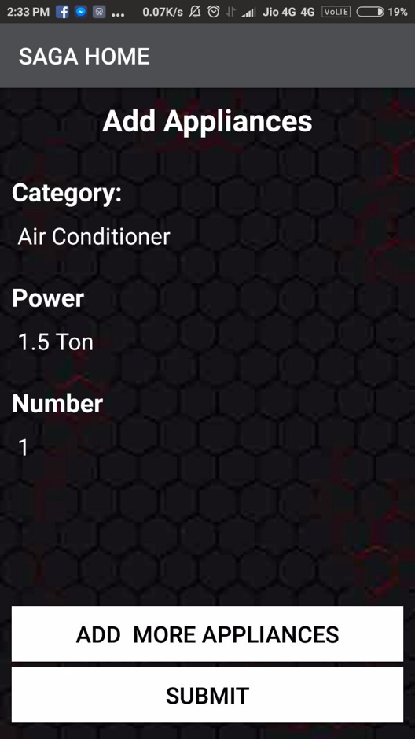
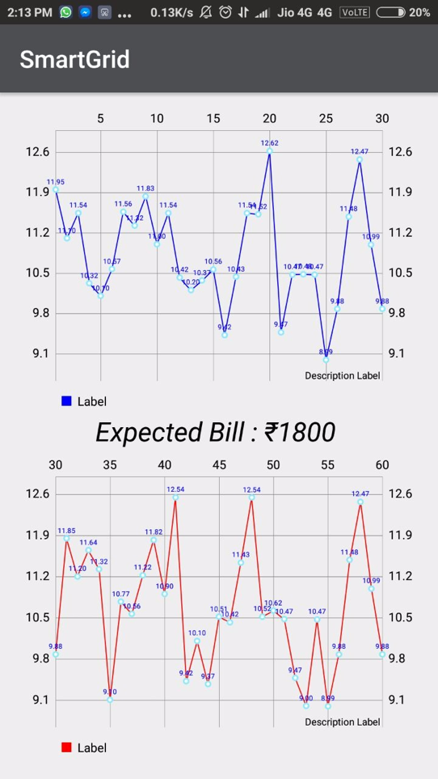
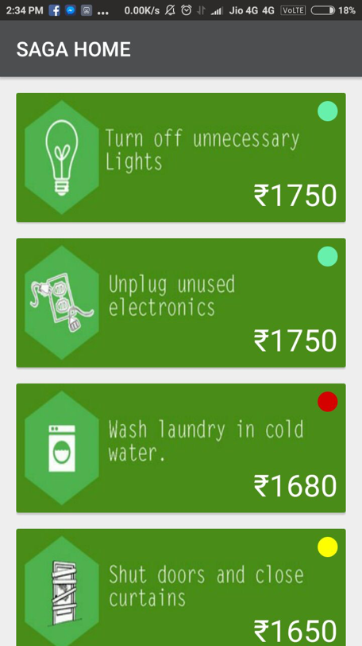
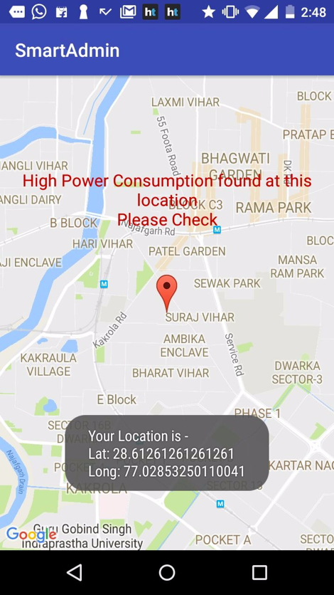
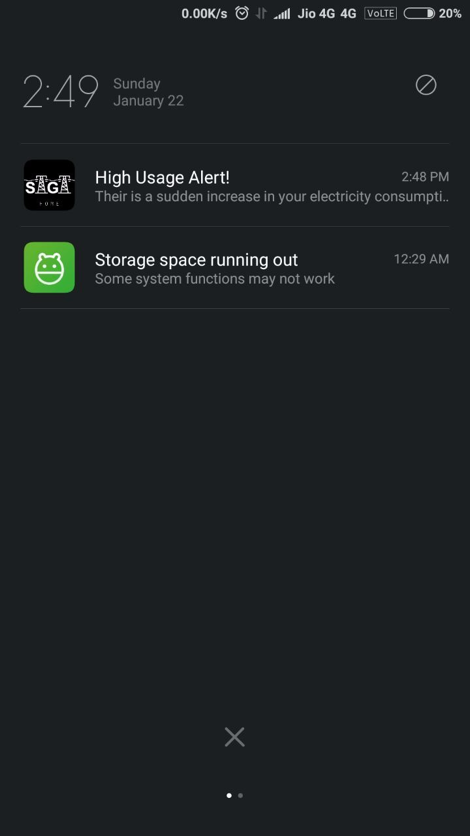

# Smart Grid Hackathon 2017 at NSIT, New Delhi, by Tata Power
Prize for Innovation
## Smart Autonomous Grid Analysis

### Goal:

Industries can afford smart meters; hence for the revolution to be victorious, industries are adapted to novel Smart Grid Features.

### Main Features:

Industry Electricity Consumption Analysis
Using TOD to set Dynamic Pricing
Using Greedy Algorithm to allocate Cheaper Time Slots  

|  |  |  |
| -------------- | -------------- | -------------- |
|  |  |  |

### Greedy Algorithm for time allocation:

The supply Cap of the power Grid is 1000 kWH for the industrial + domestic supply at any TOD (Time of the day); Peak and non-peak Hours exist due to similar usage TOD.

Goal: To create a time allocation algorithm for individual industries which will equalize the power consumption at any TOD.

1. On iteration of each industry, calculate its operation time and find the industry with the maximum consumption (Ind-MAX) during that day.
<b> OPERATION TIME (T) : The continuous time period where the industry consumes more than a certain kWH of power.</b>
2. Find the area of minimum consumption for the time T, and shift the Ind-Max to that part of the day.
3. Construct the new Power consumption graph.
4. Repeat for each following industry.

The new threshold is decided by the final graph constructed by the Greedy algorithm i.e. threshold is now variable. If any industry functions below the threshold, they are given a subsidy on the electric bill and if the industry consumes above the threshold, they are charged an overhead. Thus, improving the current Time of the Day system.

### Anomaly detection

The user data is analyzed every 15 minutes. If there is a sudden spike in the next interval of user consumption. Both the Administrator and the User are notified of the spike.

This sudden Spike can be a electricity theft or a leak.

### Multivariate Classifier for Appliance Recognition (MCAR)

1. During registration the user enters the type of appliances that are used by the household.
2. For a specific training period ( 9 - 15 months), the algorithm learns the behaviour of appliance usage.
3. The clustering algorithm based on: For a given time interval, Temperature, Wind Speed, Humidity, Electric Consumption by household, Luminance of the day are recorded. These features are then, passed onto the clustering algorithm.
4. K is specified as the number of appliances used by the household
5. The clusters are then passed to the decision tree to make them belong to a particular appliance class.

### The Bill Prediction System based on simple linear regression model.

It considers 49 features for a day.
24 for the hourly temperature and 24 for the hourly flux and one Threshold feature.
The daily consumption data of the user is recorded as the ‘Y – Matrix’. The weights are then trained using the Linear Regression (w/ Gradient Descent) ML model.

<!--  -->
